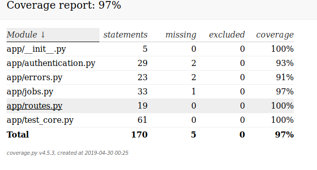

# desafio-stone
Repositório contendo a resolução do Desafio para a Stone Pagamentos

# Execução de Jobs

Tarefas custosas e demoradas infelizmente muitas vezes são parte da realidade do desenvolvimento de software. Este cenário é especialmente comum em uma arquitetura de migração de dados pois é necessário fazer processamentos que tendem a ser demorados, por exemplo, selecionar dados de um banco de dados, tratá-los para um novo formato e enviá-los para uma API. Esse problema é acentuado quando tratamos grandes quantidades e dados.

Uma forma de ter maior controle nestas situações é o uso de background jobs acompanháveis. Estes jobs são bastante úteis em cenários onde temos que executar tarefas demoradas e queremos monitorar o seu andamento.

## O desafio

Desenvolver uma plataforma de execução de Jobs que roda como uma API onde é possível iniciar tarefas em background e acompanhá-las até o seu término. Além disso, deve ser possível ter acesso às informações auxiliares que são enviadas no momento da criação do mesmo.

Os jobs podem ser qualquer tarefa que demore muito, como, por exemplo: Calcular diferentes níveis da sequência de Fibonacci, calcular diferentes níveis de precisão de Pi. Deve ser fácil adicionar novos tipos de jobs para serem agendados, executados e recuperados.

## Endpoints

Seguem abaixo os endpoints mínimos necessários para entregar o desafio. Você pode adicionar novos endpoints, caso sinta necessidade.

POST
/job
Cria um novo job

GET
/job/:id
Pega informações sobre um job pelo seu id

## Critérios de aceite

- A API deve possuir testes que não consumem o recurso real, ou seja, deve ser feito mock;
- Nenhum job pode ser perdido ou deletado;
- Precisamos conseguir agendar e recuperar jobs de diferentes tipos através do mesmo endpoint;
- Precisa respeitar o padrão RestFul para APIs;
- Temos que autenticar através de token de aplicação;
- Não é permitido o uso de ORM;
- Precisamos conseguir passar metadados para o job que podem ser recuperados;
- Atenção para utilizar os status codes do HTTP corretamente de acordo com cada operação da API;

## Meio de entrega

O Código deve estar no Github ou Gitlab.

# Executando o projeto

O projeto é executando dentro de containers docker

 - api-server contém o coódigo da aplicação e o 'worker' que processa as filas
 - redis-server contêm a instância do Redis que persiste a fila

 Para rodar a aplicação basta executar o comando

 `docker-compose up --build`

 para gerar um token de autenticação, basta fazer um POST para a api 

 `curl -u stone:pagamentos -i -X GET http://127.0.0.1:5000/token`

 Após a geração do token, basta acessar a API utilizando ele

### Endpoints

| HTTP Method | Resource URL | Notas                                             |
|-------------|--------------|---------------------------------------------------|
| POST        | /job         | Cria um novo job para ser executado em background |
| GET         | /job/<id>    | Obtém informações sobre um job existente          |

#### POST - /job
* Criar um job para execução em segundo plano

`curl -u <token_autenticacao>: -i -X POST -H "Content-Type: application/json" -d '{"job_name":"countdown", "meta": {"seconds": "60"}}' http://127.0.0.1:5000/job
`

* __countdown__ é o nome do job que será executado
* __meta__ é um dicionário com parametros que serão passados para o job. Nesse caso, ele contem a chave __seconds__ que é a quantidade de segundo que o contador deverá ser executado.

A executar o post, você receberá um json resposta com o _id_ do Job recém criado.

Ex.: 
`{
    "id": "16f51baa-8a8c-44c0-bbe1-8e3b1b32ac39",
    "message": "Job created !!!"
}`

#### GET - /job/<id>
* Busca informações sobre um Job com o _id_ informado.

`curl -u <token_gerado>: -i -H "Accept: application/json" -X GET http://localhost:5000/job/bea8f139-54f5-4c20-b4f2-dc6be2ed3e2b`

Ao executar você receberá um json com as informações do __job__

ex.: `{
    "created_at": "Mon, 29 Apr 2019 23:33:30 GMT",
    "finished_at": "Mon, 29 Apr 2019 23:34:30 GMT",
    "id": "874e74f7-1d1e-46fb-82af-33e03af73e16",
    "meta": {
        "progress": 98.33333333333333,
        "seconds": 60
    },
    "result": null,
    "started_at": "Mon, 29 Apr 2019 23:33:30 GMT",
    "status": "finished"
}`

## Testes Unitários

para rodar os testes unitários basta executar 

primeiro ative o virtualenv

`source venv/bin/activate`

Instale as dependências

`pip install -r requirements.txt`

Então execute os testes

`py.test`

## Relatório de Cobertura de Código

Se quiser um relatório de cobertura

`py.test --cov=app --cov-report html`

## Monitorar filas de processos em background

1. Entrar no container

`docker exec -it api-server /bin/sh`

2. iniciar o serviço __rq-dashboard__

`rq-dashboard -H $REDIS_SERVER`

3. Acessar a url [http://localhost:9181](http://localhost:9181)